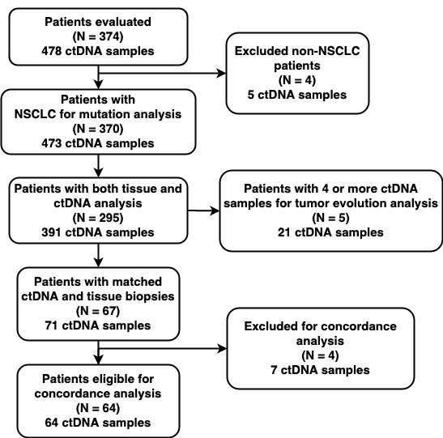

```{r setup, include=FALSE,echo=FALSE}
library(survival)
library(survminer)
library(ComplexHeatmap)
library(ggplot2)
library(dplyr)
library(tibble)
library(GenVisR)
library(reshape2)
library(stringr)

#options(repos=c(getOption("repos"), "http://ccb.nki.nl/software/discover/repos/r"))
#install.packages("discover")
library(discover)

load("~/Documents/GitHub/ctDNA_lung/ctDNA.rda")

```


## Figure 1

```{r Figure 1,echo=FALSE,cache=TRUE,warning=FALSE}
mutation_priority<-c("Amplification","Duplication","Indels","Fusion","SNPs")
mutationColours <- c("Amplification"='#4f00A8', "Duplication"='#ca66ae', "Indels"='#009933', "Fusion"='#ff9b34', "SNPs"='#A80079')

clinicalData<-aggregate(Smoking.Status~Patient.ID+Gender,prep_gg,unique)
gg_waterfall<-prep_gg[prep_gg$jfirstdate==prep_gg$Blood.Collection.Date,]
mutationData<-prep_gg[,c("Patient.ID","Gene","category","Alteration")]
clinicalData<-rbind(clinicalData,data.frame(Patient.ID=c(unique(gg_waterfall$Patient.ID[!gg_waterfall$Patient.ID%in%clinicalData$Patient.ID])),Gender=NA,Smoking.Status=NA))
clinicalData<-clinicalData[order(clinicalData$Patient.ID),]

names(clinicalData)[1]<-"sample"
clinicalData<-melt(data=clinicalData,id.vars = c("sample"))
clinicalData$value[clinicalData$value=="Unknown"]<-NA
colnames(mutationData) <- c("sample", "gene", "variant_class", "alteration")


#png(filename = "Figure 1.png",width = 14,height = 10,units = "in",res=1024)
waterfall(
  mutationData,
  fileType = "Custom",
  variant_class_order = mutation_priority,
  mainPalette = mutationColours,
  mainRecurCutoff = .05,
  mainGrid = T,
  main_geneLabSize = 12, mainLabelCol = NULL,
  mainLabelSize = 3,
  clinData = clinicalData,
  clinLegCol = 2,
  plotMutBurden = F,
  clinVarOrder = c("Female","Male","smoker","non-smoker"),
  clinVarCol = c("Female" = "pink", "Male" = "blue","smoker"="orange","non-smoker"="green"),
  section_heights = c(0,5,2))
#dev.off()


```


## Figure 2

```{r Figure 2, cache=TRUE,echo=FALSE,warning=FALSE}

sur<-(subset(prep_gone,select=c("Patient.ID","Age","Gender","Smoking.Status","ctDNAM","jlastdate","jfirstdate","dflag","jprog1date","progressedflag")))
sur<-sur[complete.cases(sur),]

pfs_ctdna<-ggsurvplot(
  survfit(
    Surv(I(jprog1date - jfirstdate)/30, progressedflag) ~ ctDNAM,
    sur,subset = (jprog1date - jfirstdate)>0
  ),
  legend.title = "Cumulative % ctDNA",
  palette = "jco",
  legend.labs = c("High","Low"),
  pval = TRUE,
  pval.coord=c(12,0.85),
  #risk.table = T,
  xlab="Time (in months)",
  ylab = "PFS Probability",
  surv.median.line="hv",
  break.time.by=6
)
ggforest(coxph(Surv(I(jprog1date-jfirstdate),progressedflag) ~ 
                 ctDNAM,sur,subset=jprog1date > jfirstdate))
pfs<-coxph(Surv(I(jprog1date-jfirstdate),progressedflag) ~ 
            Age+Gender+Smoking.Status+ctDNAM,sur,
          subset=jprog1date > jfirstdate)
ggforest(pfs,data=sur[sur$jprog1date > sur$jfirstdate,])

os_ctdna<-ggsurvplot(
  survfit(
    Surv(I(jlastdate - jfirstdate)/30, dflag) ~ ctDNAM,
    sur,subset = (jlastdate - jfirstdate)>0
  ),
  legend.title = "Cumulative % ctDNA",
  palette = "jco",
  legend.labs = c("High","Low"),
  pval = TRUE,
  pval.coord=c(12,0.85),
  #risk.table = T,
  xlab="Time (in months)",
  ylab = "OS Probability",
  surv.median.line="hv",
  break.time.by=6
)
ggforest(coxph(Surv(I(jlastdate-jfirstdate),dflag) ~ 
                 ctDNAM,sur,
               subset=jlastdate > jfirstdate))

#png(filename = "Figure2a.png",width = 8,height = 4,units = "in",res=2048)
ggarrange(ggarrange(pfs_ctdna$plot,pfs_ctdna$table,ncol = 1,nrow = 2,heights = c(2,1),align = "v", legend = "none"),
          ggarrange(os_ctdna$plot,os_ctdna$table,ncol = 1,nrow = 2,heights = c(2,1),align = "v",legend = "none"), ncol =2,
          widths = c(1.25,1.5),common.legend = TRUE,legend = "bottom") # Second row with box and dot plots
#dev.off()
kras<-ggsurvplot(
    survfit(Surv(I(
      jlastdate - jfirstdate
    )/30, dflag) ~ firstKRAS, prep_gone,
    subset = jlastdate > jfirstdate),
    pval = T,
    title = "KRAS",
    legend.title = "Mutation",
    palette = "jama",
    xlab="Time (in months)",
    ylab = "OS Probability",
    break.time.by=6,
    legend.labs = c("Negative","Positive"),
    risk.table = T
  )
    braf<-ggsurvplot(
      survfit(Surv(I(
        jlastdate - jfirstdate
      )/30, dflag) ~ firstBRAF, prep_gone,
      subset = jlastdate > jfirstdate),
      pval = T,
      title = "BRAF",
      legend.title = "Mutation",
      palette = "jama",
      xlab="Time (in months)",
      ylab = "OS Probability",
      break.time.by=6,
      legend.labs = c("Negative","Positive"),
      risk.table = T
    )
    pik3ca<-ggsurvplot(
      survfit(Surv(I(
        jlastdate - jfirstdate
      )/30, dflag) ~ firstPIK3CA, prep_gone,
      subset = jlastdate > jfirstdate),
      pval = T,
      title = "PIK3CA",
      legend.title = "Mutation",
      palette = "jama",
      xlab="Time (in months)",
      ylab = "OS Probability",
      break.time.by=6,      
      legend.labs = c("Negative","Positive"),
      risk.table = T
    )
single_mut<-(prep_gone[,c("Patient.ID","jlastdate","jfirstdate","Age","Gender","Smoking.Status","firstKRAS","firstPIK3CA","firstBRAF","dflag")])
colnames(single_mut)[7:10]<-gsub(colnames(single_mut)[7:10],pattern = "first",replacement = "")
mut_one<-ggforest(coxph(Surv(I(jlastdate-jfirstdate),dflag) ~
Age+Gender+Smoking.Status+KRAS+PIK3CA+BRAF,single_mut,
subset=jlastdate > jfirstdate))
 #png("Figure 2.png",width =8,height=10,units = "in",res = 1024)   
  ggarrange(pfs_ctdna[[1]],braf[[1]],pik3ca[[1]],kras[[1]],nrow = 2,ncol = 2,labels = c("A","B","C","D"),common.legend = F,legend = "bottom")  
 # dev.off()


```

## Figure 3

```{r Figure 3,echo=FALSE,cache=TRUE}
#png(filename = "Figure 3.png",width =9,height =8, units = "in",res = 1024)
clinical<-subset(prep_gone,select=c("Patient.ID","Gender","Race","Cancer.Type","Smoking.Status","Stage"))
clinical<-(clinical[duplicated(clinical)==F,])
clinical<-clinical[duplicated(clinical$Patient.ID)==F,]
clinical$Race[clinical$Race=="Unknown"]<-NA
clinical$Smoking.Status[clinical$Smoking.Status=="Unknown"]<-NA
clinical$Stage[clinical$Stage=="Unknown"]<-NA
clinical<-clinical[order(clinical$Patient.ID),]
clinical_simp_concor<-subset(clinical,clinical$Patient.ID%in%colnames(simp_concordance))
col = c(tissue = "cadetblue4", blood = "brown3")

oncoPrint(
  simp_concordance,
  alter_fun = list(
    background = function(x, y, w, h)
      grid.rect(x, y, w * 0.9, h * 0.9, gp = gpar(fill = "lightgrey", col = NA)),
    tissue = function(x, y, w, h)
      grid.rect(x, y, w * 0.9, h * 0.9,
                gp = gpar(fill = col["tissue"], col = NA)),
    blood = function(x, y, w, h)
      grid.rect(x, y, w * 0.9, h * 0.4,
                gp = gpar(fill = col["blood"], col = NA))
  ),
  col = col,
  row_names_gp = gpar(fontsize = 14, fontface = 2),
  column_names_gp = gpar(fontsize = 14, fontface = 2),
  pct_gp = gpar(fontsize = 13, fontface = 2),
  bottom_annotation = HeatmapAnnotation(Gender = clinical_simp_concor$Gender,
                                        Smoking.status = clinical_simp_concor$Smoking.Status,na_col = "white",col = list(Gender=c(Female="pink",Male="blue"),Smoking.status=c(smoker="orange","non-smoker"="green")))
)

#dev.off()


```

## Figure 4

```{r Figure 4,echo=FALSE,cache=TRUE}
clinical_simp_concor_amp<-subset(clinical_simp_concor,clinical_simp_concor$Patient.ID%in%colnames(amp_all))

amp<-
  oncoPrint(
  amp_all,
  alter_fun = list(
    background = function(x, y, w, h)
      grid.rect(x, y, w * 0.9, h * 0.9, gp = gpar(fill = "lightgrey", col = NA)),
    tissue = function(x, y, w, h)
      grid.rect(x, y, w * 0.9, h * 0.9,
                gp = gpar(fill = col["tissue"], col = NA)),
    blood = function(x, y, w, h)
      grid.rect(x, y, w * 0.9, h * 0.4,
                gp = gpar(fill = col["blood"], col = NA))
  ),
  top_annotation = HeatmapAnnotation(
    cbar = anno_oncoprint_barplot(),
    annotation_height = unit(2, "cm")
  ),
  right_annotation = rowAnnotation(
    rbar = anno_oncoprint_barplot(),
    annotation_width = unit(2, "cm")
  ),
  col = col,
  show_column_names = F,
  row_names_gp = gpar(fontsize = 10),
  column_names_gp = gpar(fontsize = 10),
  pct_gp = gpar(fontsize = 10),
  show_heatmap_legend = T,
  bottom_annotation = HeatmapAnnotation(Gender = clinical_simp_concor_amp$Gender,
                                        Smoking.status = clinical_simp_concor_amp$Smoking.Status,na_col = "white",col = list(Gender=c(Female="pink",Male="blue"),Smoking.status=c(smoker="orange","non-smoker"="green")))
  
)

dates<-aggregate(Blood.Collection.Date~Patient.ID,prep_gg,unique)
targetable<-c("ALK","EGFR","ERBB2","ROS1","BRAF","AKT1","PIK3CA","MTOR", "MET","RET")
actionable_mutations<-c("ALK-EML4 Fusion","EML4-ALK Fusion",
                        "BRAF V600E",
                        "EGFR Exon 19 Deletion", "EGFR L858R","EGFR L861Q","EGFR E746_A750del","EGFR L747_T751del","EGFR T790M","EGFR C797S","EGFR G719A","EGFR G719C","EGFR G719S","EGFR L747_P753delinsS","EGFR L747_A750delinsP","EGFR E746_T751delinsI","EGFR L747_T751delinsP","EGFR E746_S752delinsV","EGFR L747_A755delinsSKD","EGFR S752_I759del",
                        "MET Exon 14 Skipping SNV",#"MET c.2888-22_2888-3del",
                        "KIF5B-RET Fusion","NCOA4-RET Fusion",
                        "CD74-ROS1 Fusion", "ROS1-CD74 Fusion",
                        "NTRK1 Fusion")
tot_alt<-sum(prep_gg$Gene!="None")

#sum(prep_gg$Gene%in%targetable)
#sum(prep_gg$Alteration.Details%in%actionable_mutations)
#genes<-table(prep_gg$Gene)
#sum(genes[names(genes)%in%targetable])/tot_alt*100
#samples harboring mutations in targetable gene
#nrow(aggregate(Gene~Patient.ID+Blood.Collection.Date,prep_gg[prep_gg$Gene%in%targetable,],unique))
#samples harboring actionable mutations 
#nrow(aggregate(Gene~Patient.ID+Blood.Collection.Date,prep_gg[prep_gg$Alteration.Details%in%actionable_mutations,],unique))


#Percentages of samples harboring actionable mutations
print(paste("Percentages of samples harboring at least one mutation in a targeteable gene",round(nrow(aggregate(Gene~Patient.ID+Blood.Collection.Date,prep_gg[prep_gg$Gene%in%targetable,],unique))
/sum(unlist(lapply(dates[,2],length)))*100,digits = 1),"%",sep=" "))

print(paste("Percentages of samples harboring at least one actionable mutation with currently available FDA-approved NSCLC treatment option ",round(nrow(aggregate(Alteration.Details~Patient.ID+Blood.Collection.Date,prep_gg[prep_gg$Alteration.Details%in%actionable_mutations,],unique))
                                                                                                 /sum(unlist(lapply(dates[,2],length)))*100,digits = 1),"%",sep=" "))


###%of actionable in tissue

tissue_actionable<-sum(unlist(prep_founddf$Tissue.alt)%in%targetable)
#sum(apply(simp_concordance=="tissue",1,sum))

##actionable % in tissue discordants

tissue_actionable_discordant<-sum(apply(simp_concordance=="tissue",1,sum)[names(apply(simp_concordance=="tissue",1,sum))%in%targetable])

##actionable %in blood
blood_actionable<-sum(unlist(prep_founddf$Blood.alt)%in%targetable)


blood_actionable_discordant<-sum(apply(simp_concordance=="blood",1,sum)[names(apply(simp_concordance=="blood",1,sum))%in%targetable])#/sum(apply(simp_concordance=="blood",1,sum))*100

actionable_df<-data.frame(Actionable.Mutations=round(c(tissue_actionable,tissue_actionable_discordant,blood_actionable,blood_actionable_discordant),digits = 1),
           Group=rep(c("All","Discordant Only"),2),
           Source=rep(c("Tissue","ctDNA"),each=2))

actionable_bar<-ggplot(data=actionable_df, aes(x=Group, y=Actionable.Mutations, fill=Source)) +
  geom_bar(stat="identity", position=position_dodge())+
  scale_fill_manual(values=c('brown3','cadetblue'))+
  ylab("Number\n Actionable")+ xlab("")+
  theme_minimal()
ven <-
    VennDiagram::venn.diagram(
      list(ctDNA = prep_founddf[prep_founddf$Patient.ID %in% alk_blood$Patient.ID, 1], Tissue = prep_founddf[prep_founddf$Patient.ID %in%
                                                                                                                        alk_tissue$Patient.ID, 1]),
      col = "transparent",
      fill = c("brown3", "cadetblue"),
      filename = NULL,
      alpha = c(0.5, 0.5),
      cat.cex = 0.95
    )
grid.newpage()
gb=grid.grabExpr(draw(amp))


#png("Figure 3.png",height = 10,width=8,res = 1024)
ggarrange(gb,ggarrange(ven,actionable_bar,ncol = 2,labels = c("B","C"),widths = c(1,1)),nrow = 2,labels = c("A"),heights = c(4,2))
#dev.off()

```

## Figure 5
```{r Figure 5, echo=FALSE,cache=FALSE}

multi<-as.data.frame(combo[!combo[,4]%in%c("TX","tissue"),])
colnames(multi)<-c("Patient.ID","Mutations","Days.since.first.ctDNA.sample","ctDNA")
multi$ctDNA<-as.numeric(multi$ctDNA)
multi$Mutations[multi$Mutations=="None NA"]<-"None"
# multi_ampli<-multi[str_detect(multi$Mutations,pattern = "Amplification"),]
# #multi_ampli<-multi_ampli[!is.na(multi_ampli$Copy.Number),]
# multi<-multi[!str_detect(multi$Mutations,pattern = "Amplification"),]
# multi<-multi[multi$Mutations!="None",]
multi_pts<-c("G1","G59","G9","G220","G8")

for(pt in multi_pts){
  tmp<-subset(multi,multi$Patient.ID==pt)
  d<-unique(tmp$Days.since.first.ctDNA.sample)
  ga<-unique(tmp$Mutations)
  for(i in d){
    add_alt<-ga[!ga%in%tmp[tmp$Days.since.first.ctDNA.sample==i,"Mutations"]]
    if(length(add_alt)>0){
    tmp1<-matrix(0,ncol=4,nrow=length(add_alt),dimnames=list(c(1:length(add_alt)),c("Patient.ID","Mutations","Days.since.first.ctDNA.sample","ctDNA")))
    tmp1[,1]<-pt
    tmp1[,3]<-i
    tmp1[,4]<-0

    tmp1[,2]<-add_alt
    multi<-rbind(multi,tmp1)
    }
  }
  
}


multi_ampli<-multi[str_detect(multi$Mutations,pattern = "Amplification"),]

multi<-multi[!str_detect(multi$Mutations,pattern = "Amplification"),]
multi<-multi[multi$Mutations!="None",]
multi$ctDNA<-as.numeric(multi$ctDNA)


pt_evolution<-function(pt){
  multi_pt<-multi[multi$Patient.ID==pt,]
  multi_pt$Mutations<-factor(multi_pt$Mutations)
    return(ggplot(multi_pt, aes(x=Days.since.first.ctDNA.sample, y=ctDNA, group=Mutations,shape=Mutations,linetype=Mutations)) +
    # ylim(c(0,10))+
    scale_shape_manual(values=1:nlevels(multi_pt$Mutations)) +
    scale_linetype_manual(values=1:nlevels(multi_pt$Mutations))+
    ylab("ctDNA VAF%")+
    xlab("Days since first ctDNA sample")+
    #ggtitle(paste("Tumor evolution measured by ctDNA : ", pt, sep=" "))+
    #facet_wrap(~Patient.ID,scales="free")+
    geom_line(aes(linetype=Mutations,color=Mutations))+
    geom_point(aes(shape=Mutations,color=Mutations),size=2)+
     #theme_pubclean()
      theme(plot.title = element_blank(),
            legend.title = element_blank(),
            legend.direction = "vertical",
          axis.title.y = element_text(size = 8, face = "bold"),
          #axis.title.x = element_blank(),
          axis.text.x = element_text(size=8),
          axis.text.y = element_text(size=8),
          #title = element_text(size=12,face="bold"),
          legend.text = element_text(size=8))

    )
}
#unique(multi$Patient.ID)

g_1<-pt_evolution("G1")+ annotation_custom(grobTree(textGrob("Afatinib started at 64 days \n Clinical trial at 566 days \n Afatinib restarted at 628 days ", x=0.2,  y=0.7, hjust=0,
                                                             gp=gpar(col="blue", fontsize=10, fontface="italic"))))+
  annotation_custom(grobTree(textGrob("MYC Amplification at 958 days", x=0.4,  y=0.95, hjust=0,
                                      gp=gpar(col="red", fontsize=8, fontface="bold"))))

g9<-pt_evolution("G9")+annotation_custom(grobTree(textGrob("Carboplatin/docetaxel started at 23 days \n Erlotinib started at 525 days \n Osimertinib started at 587 days ", x=0.2,  y=0.8, hjust=0,
                                                           gp=gpar(col="blue", fontsize=10, fontface="italic"))))+
  annotation_custom(grobTree(textGrob("MET & CDK4 Amplification at 917 days\nCDK6 Amplification at 1008 days", x=0.3,  y=0.95, hjust=0,
                                      gp=gpar(col="red", fontsize=8, fontface="bold"))))


#png("Figure 5.png",height = 10,width = 10,units = "in",res = 1000)
ggarrange(g_1,g9,heights = c(3,5),nrow= 2,labels = c("A","B"),legend = NULL)
#dev.off()


```


## Supplemental Figure 1




## Supplemental Figure 2

```{r Supplemental Figure 4,echo=FALSE, cache=TRUE}
all_common<-c("ALK","ATM","BRAF","CDKN2A","CTNNB1","EGFR","ERBB2","EZH2","FBXW7", 
"FGFR1","FGFR2","FGFR3","GNAQ","GNAS","IDH1","IDH2","JAK2","JAK3","KIT","KRAS","MET",   "MLH1","PDGFRA","PIK3CA","PTEN","PTPN11","RB1","RET","SMAD4","SMO","STK11","TP53")#all genes common across all molecular testing platforms included

freq<-rbind(data.frame(Tissue=(table(unlist(prep_founddf$Tissue.alt))),Source="Tissue"),
data.frame(Tissue=(table(unlist(prep_founddf$Blood.alt))),Source="ctDNA"))
colnames(freq)[1:2]<-c("Gene","Freq")
#freq<-freq[order(freq$Freq,decreasing = F),]
mut_freq_founddf<-ggdotchart(freq, x = "Gene", y = "Freq",
           color = "Source",                                # Color by groups
           palette = c("cadetblue",  "brown3"), # Custom color palette
           sorting = "descending",                       # Sort value in descending order
           add = "segments",                             # Add segments from y = 0 to dots
           add.params = list(color = "lightgray", size = 2), # Change segment color and size
           group = "Gene",                                # Order by groups
           dot.size = 8,                                 # Large dot size
           label = round(freq$Freq,1),                        # Add mpg values as dot labels
           font.label = list(color = "white", size = 8, 
                             vjust = 0.5),              # Adjust label parameters
           
           ggtheme = theme_pubr()                        # ggplot2 theme
)+
  geom_hline(yintercept = 0, linetype = 2, color = "gray")+
  labs( x = "Genes",y = "Frequency")+
  theme(
    axis.title.x = element_text(size = 14, face = "bold"),
    axis.title.y = element_text(size = 14, face = "bold")
  )


tissue_disc=blood_disc=common_genes_alt=NULL
for(i in 1:nrow(prep_founddf)){
  tissue_disc<-c(tissue_disc,unlist(prep_founddf$Tissue.alt[[i]][!prep_founddf$Tissue.alt[[i]]%in%prep_founddf$Blood.alt[[i]]]))
  blood_disc<-c(blood_disc,unlist(prep_founddf$Blood.alt[[i]][!prep_founddf$Blood.alt[[i]]%in%prep_founddf$Tissue.alt[[i]]]))
  common_genes_alt <-
    c(common_genes_alt, intersect(prep_founddf$Blood.alt[[i]],
                                                              prep_founddf$Tissue.alt[[i]]))
}
print(paste("Discordant gene mutations in tissue only:",sum(table(tissue_disc[tissue_disc%in%all_common])),sep=" "))
print(paste("Discordant gene mutations in ctDNA only:",sum(table(blood_disc[blood_disc%in%all_common])),sep=" "))
print(paste("Concordant gene mutations in ctDNA and tissue:",sum(table(common_genes_alt)),sep=" "))

discord_blood<-data.frame(table(blood_disc))
names(discord_blood)[1]<-"Gene"
disc_b<-ggplot(data=discord_blood, aes(x=Gene, y=Freq)) +
  geom_bar(stat="identity", fill="brown3")+
  labs(y="Frequency",x="")+
  theme(axis.text.x = element_text(angle = 90,size=10,face="bold"))


discord_tissue<-data.frame(table(tissue_disc))
names(discord_tissue)[1]<-"Gene"
disc_t<- ggplot(data=discord_tissue, aes(x=Gene, y=Freq)) +
  geom_bar(stat="identity", fill="cadetblue")+
  labs(y="Frequency",x="")+
  theme(axis.text.x = element_text(angle = 90,size=10,face="bold"))

#png("Supplemental 4.png",height = 9,width=6,units = "in",res = 2000)
ggarrange(mut_freq_founddf,ggarrange(disc_t,disc_b,ncol=2,labels = c("B","C")),nrow=2,labels=c("A"))
#dev.off()

##actionable % in discordant ctDNA
print(paste("Actionable discordant genes in the 64 ctDNA matched samples: ",round(sum(discord_blood$Freq[discord_blood$Gene%in%actionable])/sum(discord_blood$Freq)*100,digits = 1),"%",sep=" "))
##actionable % in discordant Tumor
print(paste("Actionable discordant genes in the 64 tumor matched samples: ",round(sum(discord_tissue$Freq[discord_tissue$Gene%in%actionable])/sum(discord_tissue$Freq)*100,digits = 1),"%",sep=" "))

```

##Supplemental Figure 3

```{r Supplemental.Figure.3,echo=F,cache=FALSE}


g220<-pt_evolution("G220") + annotation_custom(grobTree(textGrob("Erlotinib started prior to day 0 \n Osimertinib started at 310 days ", x=0.05,  y=0.5, hjust=0,
                                               gp=gpar(col="blue", fontsize=10, fontface="italic"))))

g59<-pt_evolution("G59")+annotation_custom(grobTree(textGrob("Erlotinib first-line prior to day 0\n Osimertinib second-line started at day 341", x=0.35,  y=0.85, hjust=0,
                                                            gp=gpar(col="blue", fontsize=10, fontface="italic"))))+
  annotation_custom(grobTree(textGrob("CCNE1 Amplification at 831 days", x=0.7,  y=0.95, hjust=0,
                                      gp=gpar(col="red", fontsize=8, fontface="bold"))))

g8<-pt_evolution("G8")+annotation_custom(grobTree(textGrob("Carboplatin/alimta prior to day 0\n Osimertinib started at day 279", x=0.1,y=0.6, hjust=0,
                                                           gp=gpar(col="blue", fontsize=10, fontface="italic"))))+
  annotation_custom(grobTree(textGrob("FGFR1 Amplification at 694 days", x=0.2,  y=0.95, hjust=0,
                                      gp=gpar(col="red", fontsize=8, fontface="bold"))))

#png("Supplemental Figure 5.png",height = 8,width = 10,units = "in",res = 1000)
ggarrange(g59,ggarrange(g8,g220,ncol = 2,labels =c("B","C"),legend = "bottom"),nrow= 2,heights = c(4,5),labels = "A")
#dev.off()

```

```{r, echo=FALSE}
time<-format(Sys.time(),"%a %b %d %X %Y")
```
This analysis was run on `r time` 
